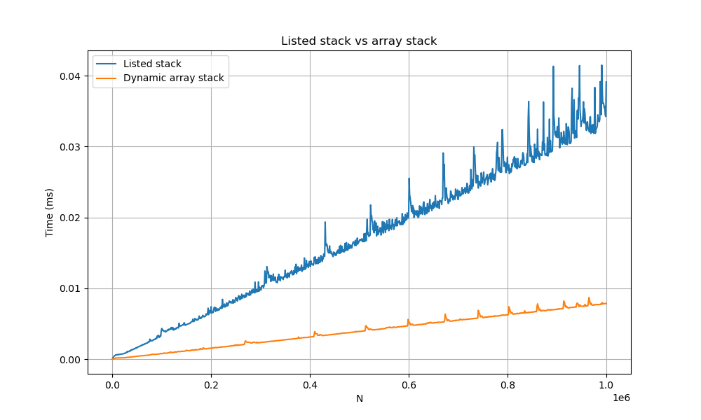

# Практическая работа 2. "Сравнение скорости работы динамического массива и односвязного списка"

Сначала оговорюсь, что все замеры производились на стэке, основанном на типе int.
Любой тест будем запускать 100 раз, затем полное время выполнения делим на количество выполнений, узнавая среднее время, а после этого повторяем процедуру 3 раза.

## Про реализацию стэка

Кратко постараюсь объяснить, почему мы сужаем динамический массив в 2 раза, когда размер уменьшаем в 4 раза. Применим метод потенциалов:

Обозначим за потенциал $\phi$, который определим следующим образом, в зависимости от $\alpha = \frac{size}{capacity}$:

$$\phi_1 = 2 \cdot size - capacity, \alpha \geqslant \frac{1}{2};$$ 

$$\phi_2 = \frac{1}{2} \cdot capacity - size, \alpha < \frac{1}{2}.$$  

### push

Рассмотрим добавление элемента. Массив расширится, если $\alpha = 1$. В таком случае $t_i = size + 1$, т.к. при ```realloc``` программа по очереди будет копировать каждый элемент в другой массив.

$$a_i = t_i + \phi_1(2 \cdot cap, size + 1) - \phi_1(cap, size) = size + 1 + (2 \cdot (size + 1) - 2 \cdot cap) - (2 \cdot size - cap) = 3.$$

Для остальных $\alpha$, $t_i = 1$ потому что копирования происходить не будет (т.к. массив не расширяется), и за операцию мы будем просто добавлять элемент в массив. Рассмотрим теперь случай $1 > \alpha \geqslant \frac{1}{2}$:

$$a_i = t_i + \phi_1(cap, size + 1) - \phi_1(cap, size) = 1 + (2 \cdot (size + 1) - cap) - (2 \cdot size - cap) = 3.$$

Теперь случай $\alpha < \frac{1}{2}$. Здесь может быть два исхода:
- При добавлении элмента $\alpha$ остается в том же диапазоне $(\alpha < \frac{1}{2})$:

$$a_i = t_i + \phi_2(cap, size + 1) - \phi_2(cap, size) = 1 + (\frac{1}{2} cap - (size + 1)) - (\frac{1}{2} cap - size) = 0.$$

- При добавлении элемента $\alpha$ переходит из $[\frac{1}{4}; \frac{1}{2})$ в $[\frac{1}{2}; 1]$:

$$a_i = t_i + \phi_1(cap, size + 1) - \phi_2(cap, size) = 1 + (2 \cdot (size + 1) - cap) - (\frac{1}{2} cap - size) = 3 + 3 \cdot size - \frac{3}{2} cap;$$

$$3 + 3 \cdot size - \frac{3}{2} cap = 3 + 3 \cdot \alpha \cdot cap - \frac{3}{2} cap < 3 + \frac{3}{2} cap - \frac{3}{2} cap = 3.$$


Таким образом получили, что амортизационное время добавления элемента в стэк при таком алгоритме - $О(1)$.

### pop

Проведем такой же анализ для удаления элемента. Массив сузится при $\alpha = \frac{1}{4}$. В таком случае $t_i = size - 1$, т.к. при ```realloc``` программа по очереди будет копировать каждый элемент в другой массив.

$$a_i = t_i + \phi_2(\frac{1}{2} cap, size - 1) - \phi_2(cap, size) = size - 1 + (\frac{1}{4} cap - (size - 1)) - (\frac{1}{4} cap - size) = 0.$$
Для остальных $\alpha$, $t_i = 1$ потому что копирования происходить не будет (т.к. массив не сужается), и за операцию мы будем просто добавлять элемент в массив. Рассмотрим теперь случай $\frac{1}{4} < \alpha < \frac{1}{2}$:

$$a_i = t_i + \phi_2(cap, size - 1) - \phi_2(cap, size) = 1 + (\frac{1}{2} cap - (size - 1)) - (\frac{1}{2} cap - size) = 2.$$

Теперь случай $\alpha \geqslant \frac{1}{2}$. Здесь может быть два исхода:
- При удалении элемента $\alpha$ остается в том же диапазоне $(\alpha \geqslant \frac{1}{2})$:

$$a_i = t_i + \phi_1(cap, size - 1) - \phi_1(cap, size) = 1 + (2 \cdot (size - 1) - cap) - (2 \cdot size - cap) = -1.$$

- При удалении элемента $\alpha$ переходит из $\alpha$ переходит из $[\frac{1}{2}; 1]$ в $[\frac{1}{4}; \frac{1}{2})$:

$$a_i = t_i + \phi_2(cap, size - 1) - \phi_1(cap, size) = 1 + (\frac{1}{2} cap - (size - 1)) - (2 \cdot size - cap) = 2 - 3 \cdot size + \frac{3}{2} cap;$$

$$2 - 3 \cdot size + \frac{3}{2} cap = 2 - 3 \cdot \alpha \cdot cap + \frac{3}{2} cap < 2 - \frac{3}{2} cap + \frac{3}{2} cap = 2.$$


Для удаления так же получаем, что амортизационное время работы - $О(1)$.

То есть, для поддержания такого времени работы мы должны сужать стэк в 2 раза, когда его размер становится меньше вместимости в 4 раза.

## Тест 1

Пушим  10^6 интов, потом удаляем половину элементов и пушим четверть - останется 750000 интов. Повторяем удаление половины и вставку четверти, пока не останется в стеке меньше 100000 элементов (получится 9 итераций).

Проведем замеры времени для двух типов стэка.

Динамический массив:
```
100 * test1 = 1.235769s         test1 = 0.01235s
100 * test2 = 1.226728s         test2 = 0.01226s
100 * test3 = 1.225124s         test3 = 0.01225s

avg = 0.01229s
```

Односвязный список:
```
100 * test1 = 7.716951s         test1 = 0.07717s
100 * test2 = 7.716883s         test2 = 0.07717s
100 * test3 = 7.744048s         test3 = 0.07744s

avg = 0.07726s
```

Получили, что в первом тесте стэк на динамическом массиве быстрее, чем на односвязном списке в среднем в 6.29 раз.

## Тест 2

Пушим  10^6 интов, потом 100 раз удаляем 10000 элементов и добавляем столько же. Далее как в первом тесте проводим 9 итераций удаления-вставки и снова 100 раз удаляем 10000 элементов и добавляем столько же.

Динамический массив:
```
100 * test1 = 2.491275s         test1 = 0.02491s
100 * test2 = 2.594827s         test2 = 0.02594s
100 * test3 = 2.461646s         test3 = 0.02461s

avg = 0.02516s
```

Односвязный список:
```
100 * test1 = 16.278748s        test1 = 0.16278s
100 * test2 = 16.157444s        test2 = 0.16157s
100 * test3 = 16.231110s        test3 = 0.16231s

avg = 0.16222s
```

Получили, что во втором тесте стэк на динамическом массиве быстрее, чем на односвязном списке в среднем в 6.45 раз.

## Тест 3

Разбираемся как генерировать случайные числа из множества {1,2}. Далее сначала доводим размер стека до миллиона, а потом выполняем миллион инструкций следующего вида: каждое выпадение единицы добавляем элемент, а на двойку - попаем из стека. Засекаем время после доведения размера стека до миллиона.

Проведем замеры времени для двух типов стэка.

Динамический массив:
```
100 * test1 = 1.352759s         test1 = 0.01352s
100 * test2 = 1.363019s         test2 = 0.01363s
100 * test3 = 1.396278s         test3 = 0.01396s

avg = 0.01370s
```

Односвязный список:
```
100 * test1 = 2.595159s         test1 = 0.02595s
100 * test2 = 2.661555s         test2 = 0.02661s
100 * test3 = 2.589031s         test3 = 0.02589s

avg = 0.02615s
```

Получили, что в третьем тесте стэк на динамическом массиве быстрее, чем на односвязном списке в среднем в 1.90 раз.

## Тест 4

Измерим 20 раз для каждого числа в диапазоне [0,10^6] с шагом 1000 время, затрачиваемое на push стольки элементов. Таким образом мы найдем для каждого такого числа диапазона более точное усредненное время. Построим график по полученным данным.



На этом графике заметно, что стэк на динамическом массиве работает заметно лучше.

## Вывод

В итоге мы видим, что абсолютно во всех тестах стек на динамическом массиве оказывается быстрее. Соответственно из-за этого я считаю, что он лучше, чем стэк на списке. Предполагаю, что разница в скорости заключается в особенностях кэширования этих структур. Программе легче и быстрее добираться между ячейками памяти, когда они лежат подряд (как и есть в динамическом массиве), нежели чем когда они могут быть разбросаны по разным местам (как в односвязном списке).
