# Cравнение сортировок

## Пункт 0. Подготовка

arraygen.c генерирует массив случайных чисел
```
./arrgen <array_len> <max_num (<0 для RAND_MAX)>
```
arraysort.c сортирует стандартным ```qsort``` числа из потока ввода. Формат ввода:
```
<array_len> array[0] array[1] ...
```
testgen.sh генерирует тесты по запросу. Формат запроса:
```
./testgen.sh <from> <to> <step> <max_num> <output_dir>
```

Сгенерируем 4 папки с тестами, ```very_small_tests```, ```small_tests```, ```big_tests``` и ```tests_most_dublicates```

Для запуска программы:
```
gcc tester.c -o tester
./tester
```

Шаблон для тестирования функций сортировок:
```
TestSort(<from>, <to>, <step>, "test_folder/", "results_folder/[...]_sort.txt", [...]_sort);
```

Формат вывода данных по времени в файл
```
size_1 time_1
size_2 time_2
size_3 time_3
...
```
Время выводится в секундах.

Для каждого пункта результаты тестов будут сохраняться в папке ```results/#_point_results```.


## Пункт 1. Квадратичные сортировки

Реализуем сортировки для первого пункта в файле ```quadratic_sorts.h```.
Прогоняем их через тесты из папки ```small_tests```.
Получаем такие результаты:

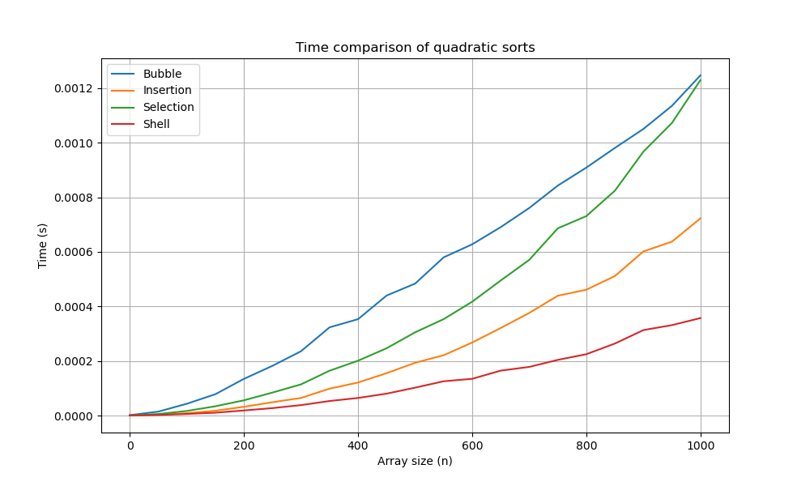

Из графика можем сделать вывод, что из всех квадратичных сортировок ```ShellSort``` является самой быстрой. Причем заметно, что она намного быстрее остальных.


## Пункт 2. Пирамидальная сортировка

Для того чтобы тестировать скорость работы пирамидальной сортировки, в зависимости от кратности кучи, немного видоизменим прототип функции сортировки и функции тестирования для этой сортировки.
Прототип функции сортировки:
```
void Heap_sort(int* array, size_t size, const int k)
```
Прототип функции тестирования остается почти таким же, за исключением того, что последний аргумент - кратность кучи в сортировке.

Реализации сортировок для этого пункта находятся в header файле ```pyramid_sorts.h```

Проверим скорость работы для кратностей от двух до десяти:

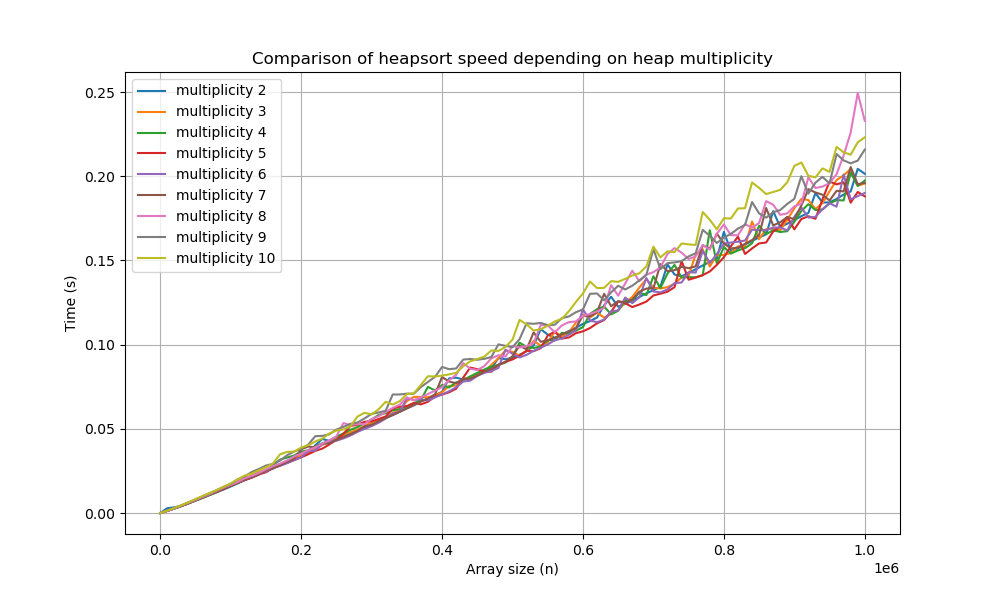

В итоге можем сделать вывод, что сортировка на куче кратности 5 оказывается самой быстрой.

## Пункт 3. Сортировка слиянием.

Сортировки слиянием мы будем реализовывать в header файле ```merge_sorts.h```.

Реализуем рекурсивную версию и итеративную версию, а затем сравним результаты скорости на графике. Проверять скорость будем на папке ```big_tests```.

В итоге после реализации сортировок мы получаем данный график:
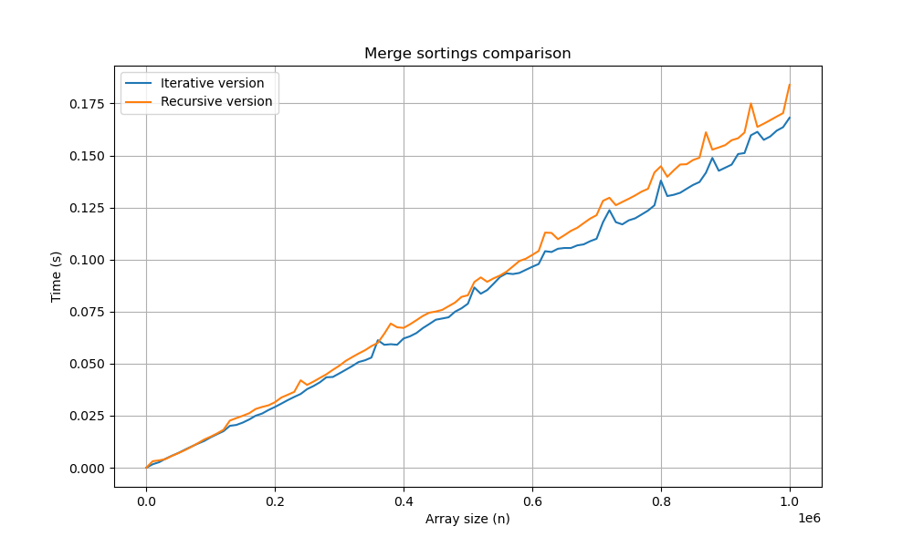

Из графика можем сделать вывод, что итеративная сортировка слиянием работает немного быстрее рекурсивной.

## Пункт 4. Быстрые сортировки (партиционирования и оптимизации)

Для удобства, напишем общую функцию ```QuickSort```, которая будет как аргумент принимать указатель на функцию нужного нам разбиения. Таким образом, мы можем менять принцип разбиения в ```QuickSort``` лишь меняя один аргумент при его вызове. Сделаем аналогичную систему при реализации быстрой сортировки с одной веткой рекурсии.

Функции для этого пункта реализованы в header файле ```quick_part_sorts.h```.

После написания трех разбиений: Хоара, Ломуто и Толстого разбиения, мы должны будем прогнать сортировки с этими разбиениями и оптимизациями (одна ветка рекурсии) через 2 массива тестов (```big_tests``` и ```tests_most_dublicates```).

Результаты для папки ```big_tests```:
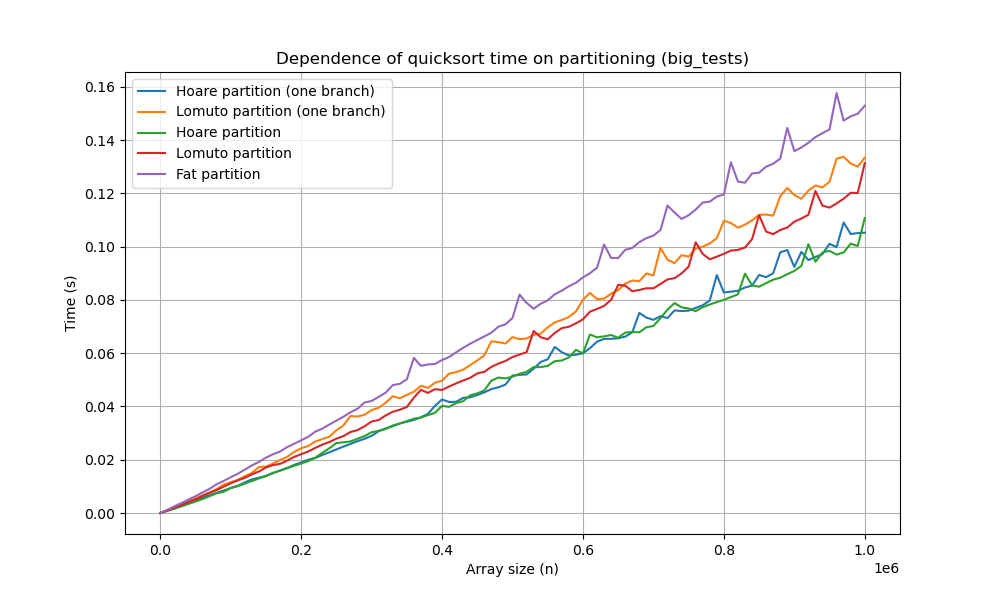

Для больших тестов можем сделать вывод, что сортировка на толстом разбиении оказывается самой медленной, а на разбиении Хоара - самой быстрой. Причем разница между всеми разбиениями значительна. При этом оказалось, что быстрая сортировка на одной ветке рекурсии работает медленнее, чем с двумя. Теперь оценим результаты на повторяющихся тестах:

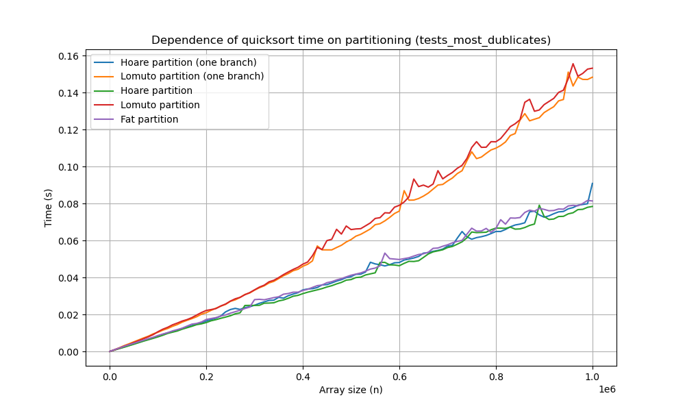

Для тестов с повторяющимися числами ситуация меняется координально. Сортировка на толстом разбиении почти догоняет по скорости разбиение Хоара. Это связано с тем, что толстое разбиение и создано для случаев, когда количество элементов, равных ```pivot``` может быть почти сравнимо с количеством остальных элементов массива. Помимо этого, на тестах с повторяющимися числами разбиение Ломуто начинает работать медленнее. Зато быстрая сортировка на одной ветке рекурсии все-таки обгоняет по скорости двух ветчатую сортировку, хоть и незначительно.

Подводя итог, можно сказать, что сортировка на разбиении Хоара работает лучше всего. Причем, количество веток рекурсии в быстрой сортировке (1 или 2) почти не меняет ситуации.

## Пункт 5. Быстрые сортировки (разные стратегии выбора, прочее)

Как мы определились в прошлом пункте, самой быстрой сортировкой выберем разбиение Хоара с двумя ветками рекурсии (по экспериментальным результатам).

Аналогично реализации прошлого пункта, сделаем общую быструю сортировку, которая будет принимать как аргумент указатель на функцию выбора ```pivot```. Реализации сохраним в header файле ```quick_pivots_sorts.h```.

Реализуем функции выбора ```pivot```, такие как:
1. Центральный элемент
2. Медиана 3
3. Случайный элемент
4. Медиана трех случайных

Результаты их скорости на тестах big_tests можем увидеть на графике:
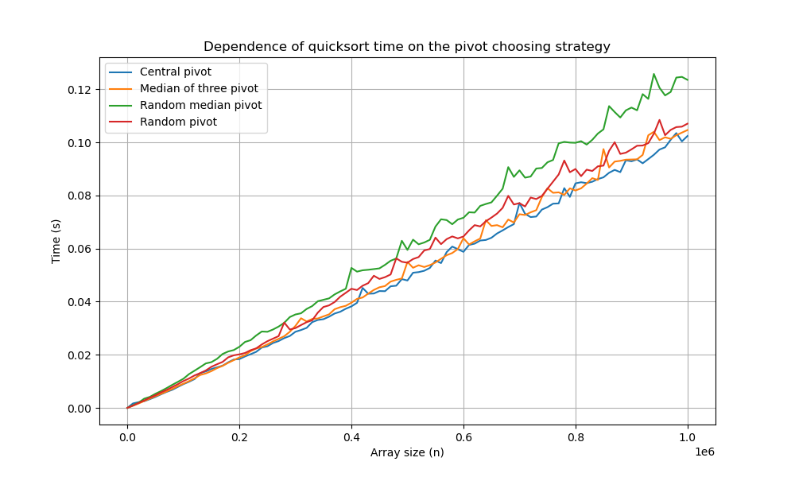

По графику заметно, что стратегии выбора с импользованием случайных элементов заметно проигрывают остальным стратегиям. Самой быстрой оказалась стратегия выбора центральног элемента, а медиана трёх случайных - самой медленной. Я предполагаю, что на это повлияла рандомная генерация самих массивов, ведь стратегия выбора случайного элемента не даст нам подобрать такие массивы, для которых сортировка могла бы работать заметно медленнее. Выбирая центральный же элемент, можно будет подобрать такой порядокэ элементов, чтобы максимально увеличить количество сравнений и замедлить сортировку. В нашем случае массивы строились на рандомной генерации чисел, поэтому в общем случае стратегия выбора центрального элемента оказалась быстрее.

## Пункт 6. Выбор размера блоков для Introsort

Как уже было определено в пунктах ранее, самой быстрой из быстрых сортировок можем взять сортировку с двумя ветками рекурсии и разбиением Хоара (стратегия выбора ```pivot``` - центральный элемент). Сравним скорость ее работы с ```shell sort``` на массивах малых размеров (папка ```very_small_tests```).

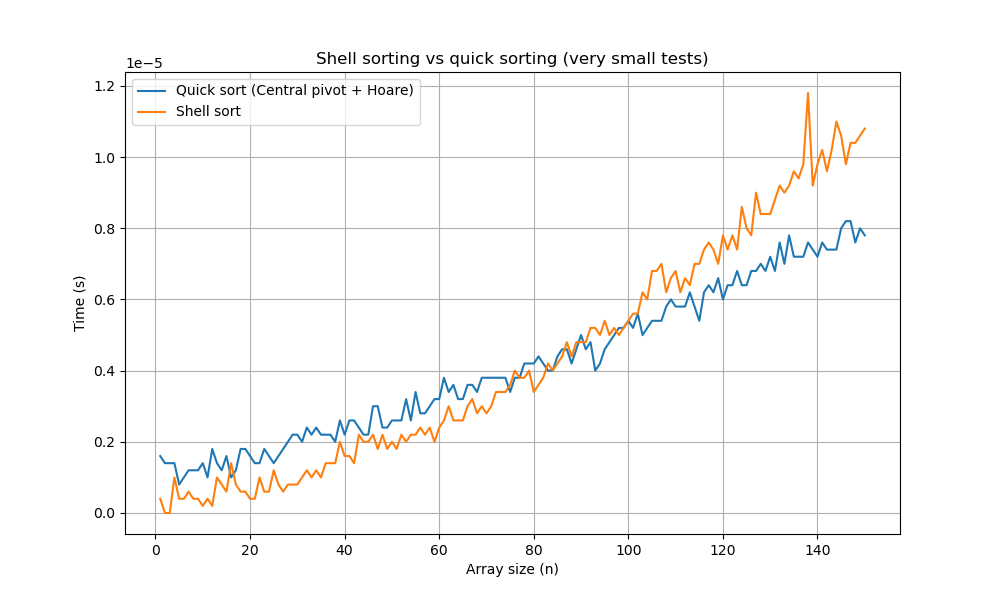

Если отбросить погрешности измерения, можно заметить что почти всегда, для размеров менее 85, ```shell sort``` работает быстрее, чем быстрая сортировка. Для размеров более 85 уже быстрая сортировка справляется быстрее. Таким образом, можем считать 85 - оптимальным размером блока.

## Пункт 7. Introspective Sorting

Все функции для этого пункта будем реализовывать в header файле ```intro_sorts.h```.

Подготовимся к написанию ```IntroSort```. Мы уже определили оптимальный размер блока, для которого мы можем испольщовать ```shell sort```, теперь стоит определиться с коэффициентом в $C \cdot \log{n}$, для глубины перехода на пирамидальную сортировку. Для этого напишем ```IntroSort```, который как аргумент будет принимать этот коэффициент $C$.

Для того, чтобы найти оптимальный $C$, нам стоит найти зависимость времени сортировки, от коэффициента $C$. Для этого нам придется немного видоизменить шаблон функции тестирования, а также саму функцию сортировки.

```
void TestCoefIntro_sort(int* arr, size_t n, const int C)
```

```
double* TestIntroSortCoeff(const size_t test_size, const char* src_path,
                           const char* dest_path, void sort(int*, size_t, const int), int C_min, int C_max)
```

Функция тестирования сортировки, будет открывать использовать файлы с тестами размера ```test_size```, лежащими в папке ```src_path```. Затем, она будет засекать время сортировки этих массивов для каждого значения от ```C_min``` до ```C_max```, и записывать их в файл ```dest_path```. После таких действий мы получим файл ```dest_path```, в котором будет сохранена зависимость $T(C)$. Отобразим ее на графике:

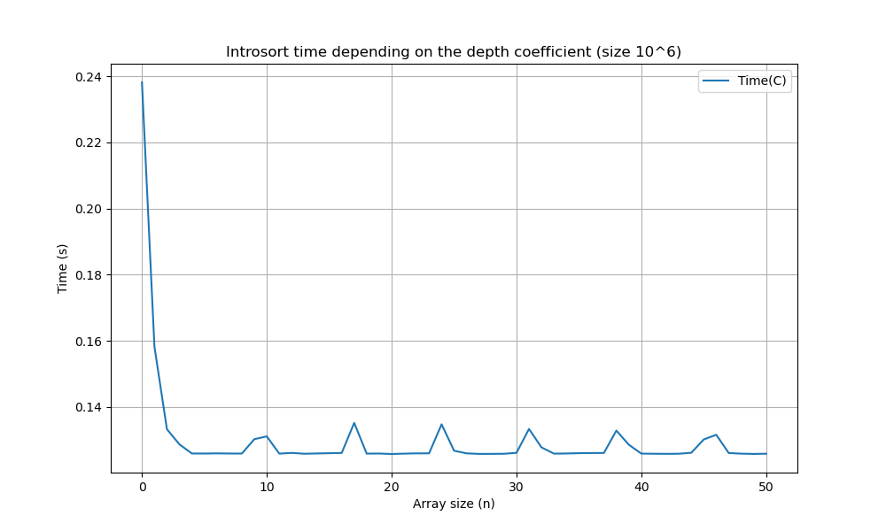

Лучшим коэффициентом, исходя из графика будет $C_{best} = 18$.

Теперь, когда мы знаем оптимальную глубину и размер блока, напишем свой Introspective sort для этих значений, и сравним с обычной быстрой сортировкой. Тестировать будем на папке ```big_tests```.

В качестве основной быстрой сортировки, используем сортировку с разбиением Хоара и центральным элементом.

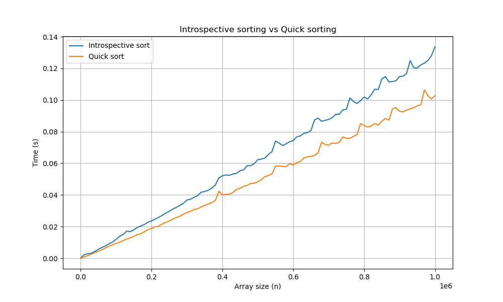

Оказывается, что в моем случае ```IntroSort``` работает заметно медленнее обычной быстрой сортировки. Возможно, это связано с тем, что моя реализация быстрой сортировки итак работает быстро, в связи с чем её оптимизация на малых размерах и больших глубинах не дает желанного результата.

Ответ: работать лучше не стало :(

## Пункт 8. Сортировки, основанные не на сравнениях

Изучим скорости работы ```LSD``` и ```MSD``` сортировок, для этого реализуем их в header файле ```MLSD_sorts.h```.
```LSD``` и ```MSD``` сортировки мы будем реализовывать, деля числа массива на байты. После тестирования на массивах большого размера мы получаем такие графики:
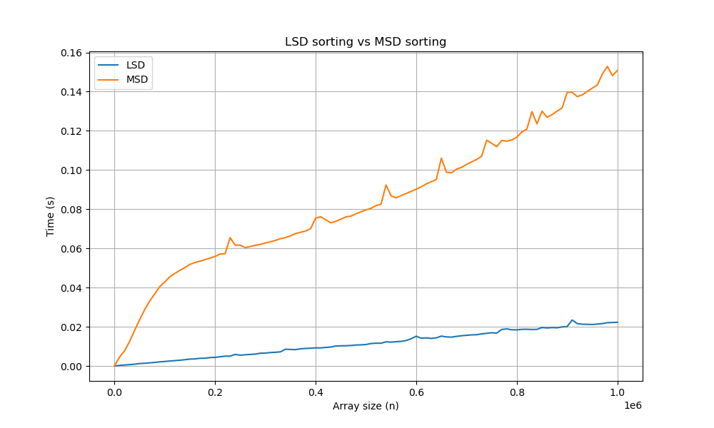

Можем сделать вывод, что сортировка LSD работает крайне быстро, по сравнению даже не только с MSD, а со всеми сортировками, рассмотренными ранее. Это связано с тем, что она не основана на сравнениях, а фактически она сама создает новый массив, в отсортированном порядке, основываясь лишь на значения байтов в элементах старого массива. Благодаря такому принципу работы, она может работать быстрее чем за $O(N \cdot \log{N})$, сортировки же основанные на сравнениях, могут работать за такую оценку лишь в лучшем случае.

## Пункт 9. Вывод

Подводя итоги, построим графики для всех быстрых сортировок из пунктов, рассмотренных нами ранее. Получится так.
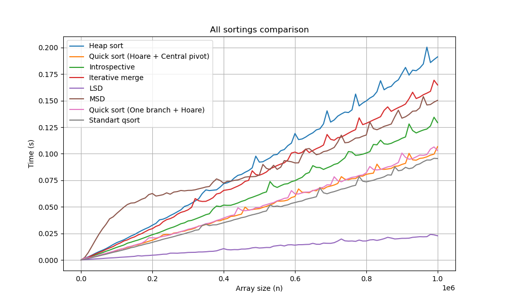

Из графика можно понять, что реализованная нами быстрая сортировка по скорости почти сравнима со стандартным ```qsort```. Также стоит отметить, что по скорости сортировки ```LSD sort``` фактически не имеет конкурентов. Он сортирует в разы быстрее любой из других сортировок рассмотренных нами. Это возможно отчасти благодаря тому, что в ```LSD sort``` нет рекурсии и крайне затратных внутренних циклов, в отличие от ```MSD sort```. Эта сортировка сравнивает байты чисел, в связи с чем у нее появляется $2^8 - 1 = 255$ веток рекурсии. Это заметно замедляет ее на фоне других сортировок при обработке массивов малой длины, но на длинных массивах она уступает лишь быстрой сортировке и ```LSD``` сортировке. Можно сказать, что график подтверждает теоретические данные о скорости сортировок:

| Вид сортировки  | $t_{avg}$                             | $t_{worst}$                           |
|:---------------:|:-------------------------------------:|:-------------------------------------:|
| Heap sort       | $O(N \cdot \log{N})$                  | $O(N \cdot \log{N})$                  |
| Quick sort      | $O(N \cdot \log{N})$                  | $O(N^2)$                              |
| Introsort       | $O(N \cdot \log{N})$                  | $O(N \cdot \log{N})$                  |
| Iterative merge | $O(N \cdot \log{N})$                  | $O(N \cdot \log{N})$                  |
| LSD sort        | $O(N \cdot K)$, $K$ - кол-во разрядов | $O(N \cdot K)$, $K$ - кол-во разрядов |
| MSD sort        | $O(N \cdot K)$, $K$ - кол-во разрядов | $O(N \cdot K)$, $K$ - кол-во разрядов |

Не подтверждает теоретические данные лишь сортировка ```MSD```, но я предполагаю, что на массивах большей длины она все-таки обгонит по скорости остальные сортировки.

Тесты выполнялись на процессоре Apple M2.


