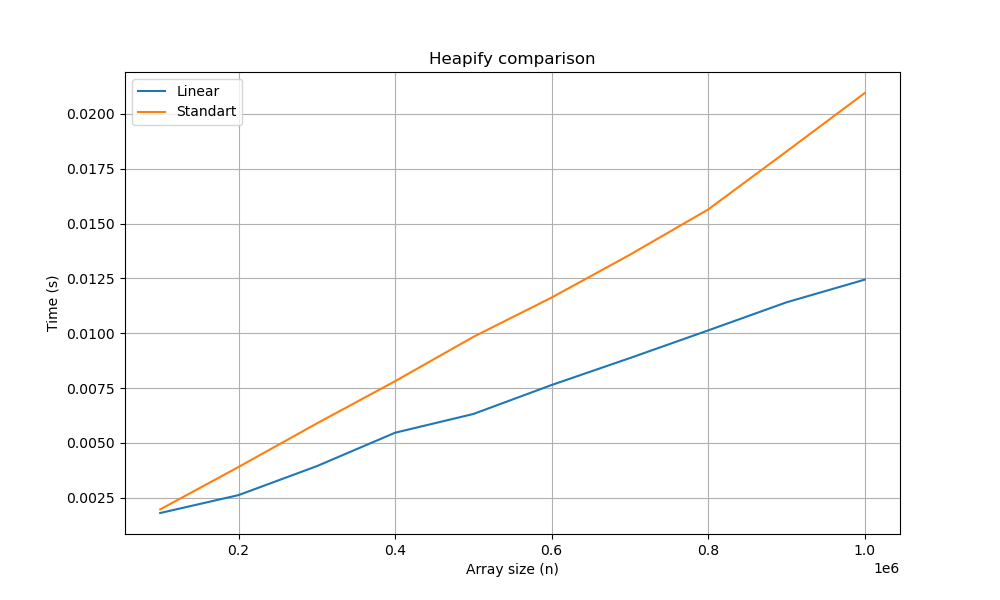

# Лабораторная работа 4 (Кучи)

## Пункт 0

Для начала нам нужно сгенерировать тесты, для того чтобы проверять сортировки. Напишем программу на Си, которая будет по данным в командной строке генерировать массив случайных чисел. Реализация этой программы хранится в файле ```arraygen.c```.

Как будем проверять валидность массива? Давайте в тестировании функции построения кучи будем проходиться по каждому элементу в массиве, и сравнивать его величину с величиной его левого и правого сына. Будем строить кучу на максимуме, то есть сыновья должны быть меньше родителя.

## Пункт 1

Реализуем две функции построения кучи.

1. Стандартное построение
2. Построение за линию

### Стандартное построение

#### Алгоритм

Пусть мы имеем массив, который нам нужно привести к виду кучи. Будем считать, что в начале мы имеем кучу из одного элемента (первого в массиве). Затем будем по очереди идти от начала массива к концу, поднимая каждый элемент внутри кучи с помощью функции ```SiftUp```. В таком случае пройдясь по каждому элементу, мы получим кучу, хранящуюся в нашем массиве.

#### Оценка времени

Добавление элемента в кучу происходит за время $O(\log{n})$. Имеем массив из $n$ элементов, каждый из которых мы должны добавить в кучу. Таким образом мы построим кучу за время $O(n \cdot \log{n})$.

### Построение за линию

#### Алгоритм

Можно построить быстрее. Можем представить, что в массиве итак хранится некая куча, которую нужно упорядочить. С помощью функции ```SiftDown``` будем спускать внутри кучи те вершины, которые имеют хотя бы одного сына (вершины с индексами от $\frac{n}{2}$ до $0$). Остальные же вершины, образующие поддеревья из одного элемента, можно считать уже упорядоченными.

#### Оценка времени

Число вершин на уровне $h$ в куче из $n$ элементов не более чем $\lceil \frac{n}{2^h} \rceil$. В таком случае построение будет работать не более чем за:

$$ T(n) = \sum\limits_{h=2}^{\log_2 n} \frac{n}{2^h} \cdot 2h = 2n \cdot \sum\limits_{h=2}^{\log_2 n} \frac{h}{2^h} \leqslant 2n \cdot \sum\limits_{h=1}^{\infty} \frac{h}{2^h}.$$


Рассмотрим сумму ряда $\sum\limits_{h=1}^{\infty} \frac{h}{2^h}$. Заметим, что $\frac{h}{2^h} =  \frac{1}{2} \cdot \frac{h - 1}{2^{h - 1}} + \frac{1}{2^h}$. Таким образом можем понять, что наш ряд это геометрическая прогрессия. Найдем её сумму по формуле $S = \frac{\frac{1}{2}}{1 - \frac{1}{2}} = 1$.

Таким образом получаем, что $T(n) \leqslant 2n \cdot 1 = O(n)$.

### Сравнение построений

Запустим построение куч на тестовых массивах, длины от $10^5$ до $10^6$. Засекать время будем как среднее за несколько тестов. Таким образом можем построить график времени выполнения от длины массива, выглядеть он будет таким образом:

|  |
|:-------------------------:|
| [Рис. 1] Сравнение скорости разных построений кучи |

Заметно, что линейный вариант построения работает заметно быстрее. Узнаем насколько он быстрее, аппроксимировав линии на графике как прямые, и сравнив их угловые коэффициенты.

$$k_{std} = \frac{(209 - 20) \cdot 10^{-4}}{(10 - 1) \cdot 10^5} \approx 21 \cdot 10^{-9};$$

$$k_{lin} = \frac{(124 - 18) \cdot 10^{-4}}{(10 - 1) \cdot 10^5} \approx 12 \cdot 10^{-9};$$

$$coef = \frac{k_{std}}{k_{lin}} \approx 1.75.$$

Таким образом, способ построения за линию быстрее примерно в 1.7 раз.

## Вывод

Подводя итоги эксперименту, можно сделать вывод, что для построения бинарной кучи более подходит способ построения за линию, так как он работает быстрее при любом размере кучи.
