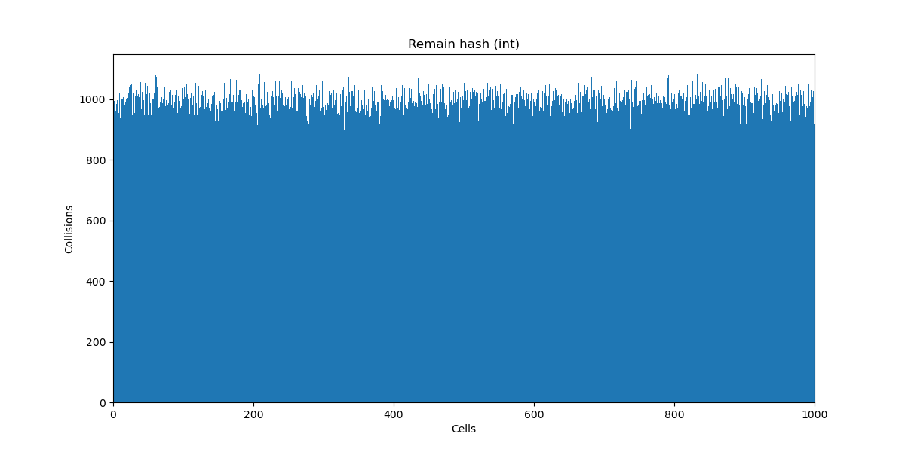

# Лабораторная работа 5 (Хеширование)

## Исследование хеш-функций

В данном пункте нам нужно исследовать распределение хеш-функций для трёх типов:

1. Целые числа (unsigned int)
2. Числа с плавающей точкой (float)
3. Строки

Реализации хеш-функий будем хранить в файле ```hashtable/hash.c```, а генерировать ключи с помощью скрипта по пути ```tests/keygen.sh```.

### Целые числа

Здесь у нас будет три разных хеш-функции:

#### Остаток от деления

Реализация достаточно проста.

```cpp
uint32_t RemainHash(const unsigned int key, const size_t arr_size)
{
    return key % arr_size;
}
```

Распределение выглядит так:



Можем увидеть, что это хорошая хеш-функция, так как она распределяет значения равномерно. Так происходит благодаря тому, что генерация наших ключей также равномерна. Если бы какой-то диапазон ключей генерировался чаще остальных, эта хеш-функция вела бы себя хуже.

#### Битовое представление

Данная хеш-функция возвращает последовательность нулей и единиц, являющуюся битовым представлением числа.

```cpp
uint32_t BitHash(const unsigned int key, const size_t arr_size)
{
    uint32_t hash = 0;
    int      mask = 0;

    for (int i = MAX_BYTE; i >= 0; i--)
    {
        mask = 1 << i;

        hash = hash * 10 + ((mask & key) >> i);
    }

    return hash % arr_size;
}
```
Распределение:


Также достаточно хорошая хеш-функция с равномерным распределением.

#### Метод Кнутта

Теперь протестируем метод умножения с константой $A$ и взятием дробной части, умноженной на размер массива.

```cpp
uint32_t KnuthHash(const unsigned int key, const size_t arr_size)
{
    static const double A = 0.6180339887;

    return (uint32_t) ((double) arr_size * ((double) key * A - (uint32_t) ((double) key * A)));
}
```

Мы берем такую константу $A$, так как она была предложена Кнуттом как наилучшая. Посмотрим теперь на распределение:


Видим, что Кнутт предложил тоже очень равномерное распределение.

### Числа с плавающей точкой (float)

Здесь мы уже рассмотрим 5 разных хеш-функций, ключи будем генерировать в диапазоне $[-10, 10]$.

#### Преобразование к (int) c последующим взятием битого представления инта

Реализация использует изученную нами ранее хеш-функцию:

```cpp
uint32_t IntBitHash(const float key, const size_t arr_size)
{
    return BitHash((unsigned int) key, arr_size);
}
```

Распределение:


Это распределение выглядит очень плохо, Большинство ключей сконцентрированы в конкретных местах. Это может быть связано с тем, что при генерации большого количества ключей, беря преобразование к целому числу мы даем очень большому множеству значений один хеш.

#### Битовое представление

Реализация чем-то напоминает реализацию для целовго числа.

```cpp
uint32_t FloatBitHash(const float key, const size_t arr_size)
{
    uint32_t hash = 0;
    int      mask = 0;

    unsigned int key_from_ptr = *((unsigned int*) &key);

    for (int i = MAX_BYTE; i >= 0; i--)
    {
        mask = 1 << i;

        hash = hash * 10 + ((mask & key_from_ptr) >> i);
    }

    return hash % arr_size;
}
```

Распределение:


Это распределение намного лучше, так как оно не дает большому множеству ключей один хеш, как это делает предыдущая функция.

#### Извлечение мантиссы

Извлечем мантиссу числа и посмотрим на распределение.

```cpp
uint32_t MantissaHash(const float key, const size_t arr_size)
{
    uint32_t hash = 0;
    int      mask = 0;

    unsigned int key_from_ptr = *((unsigned int*) &key);

    mask = 1 << 31;
    hash = (mask & key_from_ptr) >> 31;

    static const int MAX_MANTISSA_BYTE = 22;

    for (int i = MAX_MANTISSA_BYTE; i >= 0; i--)
    {
        mask = 1 << i;

        hash = hash * 10 + ((mask & key_from_ptr) >> i);
    }

    return hash % arr_size;
}
```


Как видим, это достаточно хорошее распределение.

#### Извлечение экспоненты

Аналогично извлечению мантиссы извлечем экспоненту.

```cpp
uint32_t ExponentHash(const float key, const size_t arr_size)
{
    uint32_t hash = 0;
    int      mask = 0;

    unsigned int key_from_ptr = *((unsigned int*) &key);

    static const int MIN_EXP_BYTE = 23;
    static const int MAX_EXP_BYTE = 30;

    for (int i = MAX_EXP_BYTE; i >= MIN_EXP_BYTE; i--)
    {
        mask = 1 << i;

        hash = hash * 10 + ((mask & key_from_ptr) >> i);
    }

    return hash % arr_size;
}
```


Это снова пример плохого распределения, из за того что диапазон сравнительно мал, хеши сконцентрированы в нескольких значениях, пока большая часть остается пустыми.

#### Произведение мантиссы на экспоненту

Используем полученные ранее функции, для реализации данной хеш-функции.

```cpp
uint32_t MantissaMulExponentHash(const float key, const size_t arr_size)
{
    uint32_t mantissa = MantissaHash(key, arr_size);
    uint32_t exponent = ExponentHash(key, arr_size);

    return (mantissa * exponent) % arr_size;
}
```

Распределение:


Так как это произведение двух хешей, один из которых (экспонента) распределяется крайне неравномерно, мы получаем также плохое распределение.

### Строки

#### Длина строки

Реализуем эту несложную функцию.

```cpp
uint32_t StrLenHash(const char* key, const size_t arr_size)
{
    assert(key);

    uint32_t len = strnlen(key, MAX_KEY_LEN);

    return len % arr_size;
}
```


По условию лабораторной работы мы генерировали слова длиной от 5 до 20 букв, с этим в итоге связано то, что все значения хешей лежат так же в этом диапазоне. Эту хеш-функцию не стоит использовать.

#### Сумма букв

```cpp
uint32_t ASCII_SumHash(const char* key, const size_t arr_size)
{
    assert(key);

    size_t len = strlen(key);

    uint32_t sum = 0;

    for (size_t i = 0; i < len; i++)
        sum += key[i];

    return sum % arr_size;
}
```


Можно заметить, что в нашем распределении много пиков. Это связано с тем что минимальный ASCII код буквы ``` `a` = 97 ```. Из за этого слова разной длины отличаются по сумме на порядок. Этого эффекта можно было бы избежать при меньшем размере массива, тогда пики могли бы наложиться друг на друга так, что распределение станет примерно равномерным. Все же на больших размерах не стоит использовать эту хеш-функцию.

#### Полиномиальный

```cpp
uint32_t PolynomialHash(const char* key, const size_t arr_size)
{
    static const int P = 12582917;
    static const int K = 'z' - 'a' + 1;

    uint32_t hash = 0;

    size_t i = 0;

    while (key[i])
    {
        hash = (hash * K + key[i++]) % P;
    }

    return hash % arr_size;
}
```


Данная функция достаточно равномерно хеширует наши слова.

#### crc32

```cpp
uint32_t CRC32_Hash(const char* key, const size_t arr_size)
{
    assert(key);

    uint32_t crc = -1;

    int i = 0;

    while (key[i] != 0)
    {
        crc = crc ^ (key[i] << 24);
        for (int bit = 0; bit < 8; bit++)
        {
            if (crc & (1L << MAX_BYTE))
                crc = (crc << 1) ^ 0x04C11DB7;
            else
                crc = (crc << 1);
        }

        i++;
    }
    return ~crc % arr_size;
}
```


Эта хеш-функция тоже очень хорошо и равномерно распределяет ключи.

## Сравнение хеш-таблиц

Реализуем хеш-таблицу с методом разрешения коллизий с помощью цепочек, а так же еще одну хеш-таблицу, использующую открытое хеширование.

Хеш-таблица с открытым хешированием будет использовать тестирования трёх типов (они будут выбираться как параметр при создании таблицы):

1. Линейное тестирование
2. Квадратичное тестирование
3. Двойное хеширование

Также при создании таблиц, будем передавать им как аргумент ```load_factor``` типа ```double```, при котором наша таблица будет выполнять расширение и ```rehash```.

Написав все эти таблицы, определимся при каком ```load_factor``` они будут работать быстрее всего. Сначала рассмотрим случай с таблицами открытого хеширования, так как цепочечное хеширование может иметь немного другой диапазон для ```load_factor```.

### Открытое хеширование

Произведем 1 млн. случайных вставок и замеряем время при разных значениях ```load_factor```. ```load_factor``` будем искать в диапазоне $[0.10, 1]$, т.к. он не может быть больше 1 для такого типа хеширования.


Можем увидеть, что при любом типе тестирований графики имеют пики примерно в одних и тех же местах. Причем быстрее всего открытая адресация работает примерно при ```load_factor = 0.35```.

### Хеширование методом цепочек

Аналогично произведем 1 млн. операций и посмотрим на результат. Но в этот раз будем искать ```load_factor``` в диапазоне $[0.1, 25]$.


По этому графику можно понять, что начиная с какого то момента, время работы таблицы в среднем растет с увеличением ```load_factor```. Приблизим график в начале, чтобы понять с какого момента начинается такая тенденция.


Получается для хеширования методом цепочек примерно после ```load_factor = 0.7``` время работы начинает расти в ростом ```load_factor```.

### Операции с таблицами

Мы уже выбрали оптимальные ```load_factor``` для каждого типа хеширования, тогда давайте сгенерируем тесты для таблицы, которые содержат в себе некоторое количество операций. Затем засечем время, за которое таблица сможет исполнить эти операции.

Скрипт ```tests/reqgen.sh``` генерирует папку с тестами по запросу.

#### Случай с одинаковой вероятностью запросов

В этом случае вероятности всех операций в файле одинаковы.


Как мы видим, метод тестирования не сильно влияет на скорость работы таблицы с открытым хешированием. Но главное, что можно заметить, это что таблица с хешированием методом цепочек работает заметно дольше. Вероятно это связано с тем, что открытое хеширование более "cache-friendly".

#### Случай с разной вероятностью запросов

Вся разница с рассмотренным ранее случаем в том, что теперь вероятность вставки - 0.5, а удаления и поиска - 0.25 каждая.


Как мы видим, увеличение количества вставок не сильно повлияло на ситуацию. Таблица с хешированием методом цепочек все так же работает заметно медленнее остальных.

### Промежуточный вывод

Исследовав влияние ```load_factor``` на время работы, а также сравнив время работы таблиц разных типов можно прийти к данным выводам:

1. Для таблицы с хешированием методом цепочек будет оптимально использовать ```load_factor = 0.7```.
2. Для таблицы с открытым хешированием стоит брать ```load_factor = 0.35```.
3. Таблица, использующая открытое хеширование работает заметно быстрее таблицы с хешированием методом цепочек.

## Сравнение идеального хеширования с обычным

Реализуем теперь в том числе таблицу, использующую идеальное хеширование.

При создании этой таблицы мы должны передать ей некоторое количество ключей (через массив), а после этого мы не сможем добавлять новые элементы. Мы можем лишь обращаться к таблице с запросом, имеется ли нужный элемент в множестве, заданном ранее.

Давайте заполним три типа таблиц, уже использованных в работе, 1 миллионом ключей, а затем сравним скорость работы каждой таблицы после 10 миллионов запросов поиска.

Для этого нам потребуется сгенерировать массив попарно разных ключей, в этом нам поможет одна из реализованных ранее хеш-таблиц. К ней мы будем обращаться с запросом при генерации каждого нового числа, а добавлять в массив число сможем только если оно не нашлось в хеш-таблице.

Запустим тестирование для сравнения скоростей таблицы с идеальным хешированием, открытым хешированием, и двойным хешированием. Получим данные результаты:

```
LISTED MAP: 5.0020170 (s)
OPENED MAP: 3.3528380 (s)
IDEAL  MAP: 4.7142630 (s)
```

| Тип хеширования | Время работы на 10 млн. запросов поиска, с |
|:--:|:--:|
| Открытое | 3.3528380 |
| Идеальное | 4.7142630 |
| Цепочками | 5.0020170 |

Как мы видим, в моем случае идеальное хеширование оказалось не самым быстрым. Открытое показало себя лучше. Самым медленным же является таблица, использующая метод цепочек. Я могу предположить, что такие результаты связаны с тем, что идеальное хеширование и хеширование методом цепочек используют кэш не самым оптимальным образом, в связи с чем открытое хеширование оказывается быстрее.

## Вывод

Подводя итог лабораторной работе можно отметить данные факты:

1. Стоит ответственно подходить к выбору хеш-функции, ведь некоторые из них могут казаться нормальными, но иметь ужасное распределение.

2. В результате эксперимента оказалось, что оптимальнее всего будет брать ```load_factor``` в диапазоне $[0.2, 0.8]$. При слишком маленьком ```load_factor``` наша таблица использует большое количество памяти, что негативно сказывается на кэше и соответственно на времени работы. При слишком большом ```load_factor``` наша таблица будет очень долго искать нужную ячейку.

3. Таблицы, не оптимально использующие кэш (идеальное хеширование, хеширование методом цепочек), заметно проигрывают в скорости таблице с открытым хешированием.
