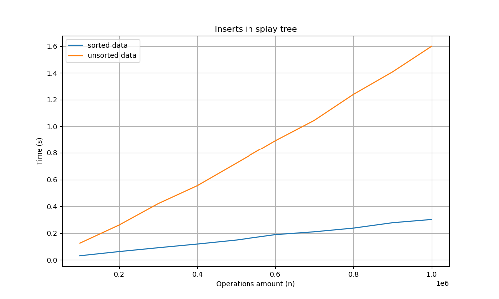
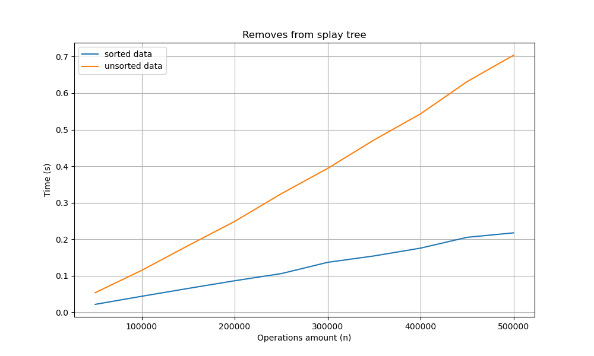

# Лабораторная работа 6 (Деревья)

## Тестирование

В работе мы будем реализовывать различные типы деревьев, для которых мы должны будем замерять время на вставку и удаление.

Чтобы не писать для каждого типа отдельную тестировочную функцию, сделаем это таким образом:

Для каждого дерева нам нужны 4 основные функции: ```Ctor```, ```Dtor```, ```Insert```, ```Remove```. Приведем их к одному стандарту для каждого дерева.

```cpp
typedef void* (*ctor_t)(void);
typedef void  (*dtor_t)(void*);

typedef void  (*operation_t)(void*, const int);
```

Таким образом, чтобы протестировать какое-то дерево, нам нужно будет передать в функцию-тестировщик 4 описанных выше функции в качестве аргумента.

Тесты же будем генерировать с помощью скрипта по пути ```tests/testgen.sh```. Данный скрипт генерирует папку с тестами, причем так, что на одно тестирование будет генерироваться два файла. Один из файлов содержит ключи для вставки в дерево, а второй - для удаления.

## Наивное дерево поиска

### Неотсортированный набор

В самом начале реализуем наивное дерево поиска и замеряем время для неотсортированного массива данных.

```
INS:
100000 (size), 0.0439988 (time, s)
DEL:
50000 (size) 0.0212074 (time, s)
```

### Сортированный набор

Далее в условии просится замерять время для отсортированного массива данных, размером $10^6$. Я запустил тестирование, но оно длилось крайне долго (характерное время одного прохода ~5-10 минут, а для того чтобы посчитать среднее по 5 проходам потребуется ~30-60 минут на тестирование). Предполагаю, что в задании подразумевался размер $10^5$, поэтому я проведу измерения для него. (Если я неправ, то в любом случае время для второго варианта стремится к бесконечности, относительно неотсортированного набора данных).

```
INS:
100000 (size), 13.7624492 (time, s)
DEL:
50000 (size), 2.4863080 (time, s)
```

Вставка стала работать дольше в $\frac{13.76}{0.04} \approx 350$ раз.
Удаление стало работать дольше в $\frac{2.49}{0.02} \approx 120$ раз.

Можно сделать вывод, что на сортированном наборе данных дерево строится намного дольше. Связать это можно с тем, что при вводе сортированного набора, мы не балансируем дерево и строим "бамбук". Из-за этого нам приходится проходить по каждой вершине дерева, чтобы добавить новый элемент.

## AVL-дерево

В наивном дереве поиска мы лишь делали одно измерение времени, теперь же мы можем проделать несколько измерений и по ним построить график.

Реализуем AVL-дерево и сравним графики получившихся результатов.


В AVL дереве при вводе отсортированных данных операции вставки и удаления начинают работать быстрее, чем при неотсортированных данных.

## Декартово дерево

Проделаем аналогичный эксперимент для декартова дерева.


В декартовом дереве ситуация аналогична AVL-дереву. Набор отсортированных данных ускоряет работу дерева. Но, когда в AVL-дереве разница между отсортированным набором и неотсортированным была визуально одинакова для вставок и для удалений, в декартовом дереве немного иначе. Визуально кажется, будто разница в времени при удалении элементов менее значительна, чем при вставке. Но она в любом случае имеет вес.

## Splay дерево

Проделаем аналогичный эксперимент вновь, но уже для splay дерева.




Для этого дерева можем заметить, что при вставке разница во времени крайне зависит от того, отсортированы данные или нет. Отсортированный набор тратит примерно в 5 раз меньше времени. При удалении элементов разница уже меньше (примерно в 3.5 раза), но всё так же велика.

## Вывод

Давайте теперь же сравним наши деревья друг с другом (кроме наивного дерева поиска, которое очевидно самое медленное) на разных наборах данных.

### Cортированный набор:


Для вставок можем заметить, что быстрее всего будет работать splay дерево, в то время как остальные работают примерно одинаково.


Рассматривая удаления ситуация уже меняется. Здесь декартово дерево заметно ускоряется и в итоге становится самым быстрым. Но все же, она работает за сравнимое со splay деревом время.

Таким образом, для cортированного набора данных лучше подходит splay дерево, так как оно хорошо себя показывает и при вставке и при удалении.

### Неотсортированный набор:


По графику видим, что вставки быстрее всего работают на AVL дереве.


При удалении элементов, AVL дерево уже заметно замедляется. Зато самым быстрым вновь становится декартово дерево.

Cравнив все графики можно сделать еще один важный вывод. Удаление из декартова дерева происходит очень быстро, вне зависимости от того сортирован ли набор входных данных или нет. Поэтому, если в работе потребуется достаточно часто удалять элементы, имеет смысл использовать декартово дерево.
